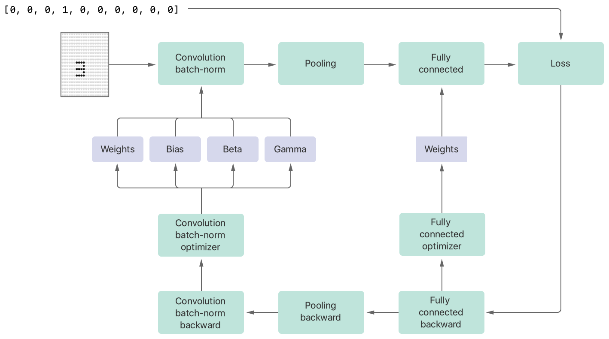
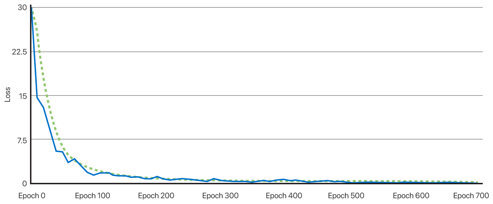

# Training a Neural Network to Recognize Digits 

Build a simple neural network and train it to recognize randomly generated numbers.

## Overview

This sample code project shows you how to use BNNS to create a simple neural network that's capable of recognizing digits.

The sample iterates over randomly generated digits in the training phase — incrementally improving its ability to recognize numbers. After the code completes the training phase, it evaluates its accuracy at recognizing numbers, and returns a score.

Each digit is represented as a 6 x 6 matrix. For example, the number `3` is represented as:

``` swift
static let three: [Float] = [0, 1, 1, 1, 1, 0,  // ⚪️⚫️⚫️⚫️⚫️⚪️
                             0, 0, 0, 0, 1, 0,  // ⚪️⚪️⚪️⚪️⚫️⚪️
                             0, 1, 1, 1, 1, 0,  // ⚪️⚫️⚫️⚫️⚫️⚪️
                             0, 0, 0, 0, 1, 0,  // ⚪️⚪️⚪️⚪️⚫️⚪️
                             0, 1, 1, 1, 1, 0,  // ⚪️⚫️⚫️⚫️⚫️⚪️
                             0, 0, 0, 0, 0, 0]  // ⚪️⚪️⚪️⚪️⚪️⚪️
```

The network consists of three layers:

* Fused convolution-batch normalization
* Pooling
* Fully connected

After the code completes a forward pass, it calculates its loss, that is a score that indicates how the predicted values deviate from the labels. The gradients generated by the loss are used as the basis for the backward pass, where the three layers are backward-applied in reverse order.

The backward passes generate gradient values that an optimizer uses to update the following parameters:

* Convolution weights, that are initialized with random values, and bias
* Normalization beta (offset) and gamma (scale) 
* Fully connected weights

The gradual changes to the weights, bias, beta, and gamma that increases the network's efficacy in recognizing digits.

The following image shows the relationships between the layers:



## Define Filter Parameters

Create a [`BNNSFilterParameters`](https://developer.apple.com/documentation/accelerate/bnnsfilterparameters) structure with [`useClientPointer`](https://developer.apple.com/documentation/accelerate/bnnsflags/2915304-useclientpointer). This flag instructs the layers to keep the pointers provided at creation time and to work directly from that data rather than using internal copies of the data.

``` swift
static var filterParameters = BNNSFilterParameters(
    flags: BNNSFlags.useClientPointer.rawValue,
    n_threads: 1,
    alloc_memory: nil,
    free_memory: nil)
```

## Create the Fused Convolution-Batch Normalization Layer

This layer consists of two sublayers:

* Convolution layers that generate their output by multiplying each input value and its neighbors by corresponding values in an array of weights, and then adding a corresponding bias. Each output value is the sum of each of those operations. Convolution layers are fundamental to convolutional neural networks and, with the correct weights and bias values, can identify features such as horizontal and vertical lines.
* Normalization layers rescale their data so that all of the batches of data have the same standard deviation.

The convolution weights array is initialized with random values:

``` swift
static let convolutionWeightsArrayShape = BNNS.Shape.convolutionWeightsOIHW(
    convolutionKernelSize,
    convolutionKernelSize,
    convolutionInputImageChannels,
    convolutionOutputImageChannels)

static let convolutionWeightsArray = BNNSNDArrayDescriptor.allocate(
    randomIn: Float(-0.5)...0.5,
    shape: convolutionWeightsArrayShape,
    batchSize: batchSize)
```

Note that the random values for the convolution weights array are generated using [`random(in:)`](https://developer.apple.com/documentation/swift/float/2995568-random). This initializer returns random values from a continuous uniform distribution. [`BNNSNDArrayDescriptor`](https://developer.apple.com/documentation/accelerate/bnnsndarraydescriptor) also provides `allocate(randomIn:using:shape:)` that allows specifying a generator as a source for randomness.

The convolution bias, and the batch normalization beta and gamma arrays are initialized by repeating a scalar value:

``` swift
static let convolutionBiasArray = BNNSNDArrayDescriptor.allocate(
    repeating: Float(0),
    shape: .vector(convolutionOutputImageChannels),
    batchSize: batchSize)

static let featureMaps = convolutionOutputImageChannels

static let batchNormBetaArray = BNNSNDArrayDescriptor.allocate(
    repeating: Float(0),
    shape: .vector(featureMaps),
    batchSize: batchSize)

static let batchNormGammaArray = BNNSNDArrayDescriptor.allocate(
    repeating: Float(1),
    shape: .vector(featureMaps),
    batchSize: batchSize)
```

The following code creates the fused layer that applies convolution and normalization to the input:

``` swift
static var fusedConvBatchNormLayer: BNNS.FusedLayer = {
    guard let fusedConvBatchNormLayer = BNNS.FusedConvolutionNormalizationLayer(
            input: inputArray,
            output: batchNormOutputArray,
            convolutionWeights: convolutionWeightsArray,
            convolutionBias: convolutionBiasArray,
            convolutionStride: (1, 1),
            convolutionDilationStride: (1, 1),
            convolutionPadding: .symmetric(x: convolutionPadding,
                                           y: convolutionPadding),
            normalization: .batch(movingMean: batchNormMovingMeanArray,
                                  movingVariance: batchNormMovingVarianceArray),
            normalizationBeta: batchNormBetaArray,
            normalizationGamma: batchNormGammaArray,
            normalizationMomentum: 0.9,
            normalizationEpsilon: 1e-07,
            normalizationActivation: .rectifiedLinear,
            filterParameters: filterParameters) else {
        fatalError("Unable to create `fusedConvBatchNormLayer`.")
    }
    
    return fusedConvBatchNormLayer
}()
```

## Create the Pooling Layer

Pooling layers downscale their input while preserving the most important information, and produce an output that, in the case of this sample, consists of the maximum value in each input pixel's local neighborhood.

The following code creates the pooling layer:

``` swift
static var poolingLayer: BNNS.PoolingLayer = {
    guard let poolingLayer = BNNS.PoolingLayer(
            type: .max(xDilationStride: 1, yDilationStride: 1),
            input: batchNormOutputArray,
            output: poolingOutputArray,
            bias: nil,
            activation: .identity,
            kernelSize: (2, 2),
            stride: (2, 2),
            padding: .zero,
            filterParameters: filterParameters) else {
        fatalError("Unable to create `poolingLayer`.")
    }
    
    return poolingLayer
}()
```

## Create the Fully Connected Layer

Fully connected layers compute the matrix-vector product of a weights matrix and its input — flattening the data to predict the correct label.

The fully connected weights array is initialized with random values:

``` swift
static let fullyConnectedWeightsArray = BNNSNDArrayDescriptor.allocate(
    randomIn: Float(-0.5)...0.5,
    shape: .matrixRowMajor(poolingOutputSize,
                           fullyConnectedOutputWidth),
    batchSize: batchSize)
```

The following code creates the fully connected layer:

``` swift
static var fullyConnectedLayer: BNNS.FullyConnectedLayer = {
    
    let desc = BNNSNDArrayDescriptor(dataType: .float,
                                     shape: .vector(poolingOutputSize))
    
    guard let fullyConnectedLayer = BNNS.FullyConnectedLayer(
            input: desc,
            output: fullyConnectedOutputArray,
            weights: fullyConnectedWeightsArray,
            bias: nil,
            activation: .identity,
            filterParameters: filterParameters) else {
        fatalError("Unable to create `fullyConnectedLayer`.")
    }
    
    return fullyConnectedLayer
}()
```

## Create the Loss Layer

The loss layer is responsible for quantifying a score that indicates how the predicted values deviate from the labels.

The following code creates the loss layer:

``` swift
static var lossLayer: BNNS.LossLayer = {
    
    guard let lossLayer = BNNS.LossLayer(input: fullyConnectedOutputArray,
                                         output: lossOutputArray,
                                         lossFunction: .softmaxCrossEntropy(labelSmoothing: 0),
                                         lossReduction: .reductionMean,
                                         filterParameters: filterParameters) else {
        fatalError("Unable to create `lossLayer`.")
    }
    
    return lossLayer
}()
```

## Create the Candidate Input

For each iteration of the training phase, create a matrix that represents a random digit, and a _one-hot_ encoded tensor of the same digit. Digits are placed randomly in a 20 x 20 matrix, so a `3` might be represented in the matrix as (with `0` rendered as `⚪️`, and `1` rendered as `⚫️`.):

```
⚪️⚪️⚪️⚪️⚪️⚪️⚪️⚪️⚪️⚪️⚪️⚪️⚪️⚪️⚪️⚪️⚪️⚪️⚪️⚪️
⚪️⚪️⚪️⚪️⚪️⚪️⚪️⚪️⚪️⚪️⚪️⚪️⚪️⚪️⚪️⚪️⚪️⚪️⚪️⚪️
⚪️⚪️⚪️⚪️⚪️⚪️⚪️⚪️⚪️⚪️⚪️⚪️⚪️⚪️⚪️⚪️⚪️⚪️⚪️⚪️
⚪️⚪️⚪️⚪️⚪️⚪️⚪️⚪️⚪️⚪️⚪️⚪️⚪️⚪️⚪️⚪️⚪️⚪️⚪️⚪️
⚪️⚪️⚪️⚪️⚪️⚪️⚪️⚪️⚪️⚪️⚪️⚪️⚪️⚪️⚪️⚪️⚪️⚪️⚪️⚪️
⚪️⚪️⚪️⚪️⚪️⚪️⚪️⚪️⚪️⚪️⚪️⚪️⚪️⚪️⚪️⚪️⚪️⚪️⚪️⚪️
⚪️⚪️⚪️⚪️⚪️⚪️⚪️⚪️⚪️⚪️⚪️⚪️⚪️⚪️⚪️⚪️⚪️⚪️⚪️⚪️
⚪️⚪️⚪️⚪️⚪️⚪️⚪️⚪️⚪️⚪️⚪️⚪️⚪️⚪️⚪️⚪️⚪️⚪️⚪️⚪️
⚪️⚪️⚪️⚪️⚪️⚪️⚪️⚪️⚪️⚪️⚪️⚪️⚪️⚪️⚪️⚪️⚪️⚪️⚪️⚪️
⚪️⚪️⚪️⚪️⚪️⚪️⚫️⚫️⚫️⚫️⚪️⚪️⚪️⚪️⚪️⚪️⚪️⚪️⚪️⚪️
⚪️⚪️⚪️⚪️⚪️⚪️⚪️⚪️⚪️⚫️⚪️⚪️⚪️⚪️⚪️⚪️⚪️⚪️⚪️⚪️
⚪️⚪️⚪️⚪️⚪️⚪️⚫️⚫️⚫️⚫️⚪️⚪️⚪️⚪️⚪️⚪️⚪️⚪️⚪️⚪️
⚪️⚪️⚪️⚪️⚪️⚪️⚪️⚪️⚪️⚫️⚪️⚪️⚪️⚪️⚪️⚪️⚪️⚪️⚪️⚪️
⚪️⚪️⚪️⚪️⚪️⚪️⚫️⚫️⚫️⚫️⚪️⚪️⚪️⚪️⚪️⚪️⚪️⚪️⚪️⚪️
⚪️⚪️⚪️⚪️⚪️⚪️⚪️⚪️⚪️⚪️⚪️⚪️⚪️⚪️⚪️⚪️⚪️⚪️⚪️⚪️
⚪️⚪️⚪️⚪️⚪️⚪️⚪️⚪️⚪️⚪️⚪️⚪️⚪️⚪️⚪️⚪️⚪️⚪️⚪️⚪️
⚪️⚪️⚪️⚪️⚪️⚪️⚪️⚪️⚪️⚪️⚪️⚪️⚪️⚪️⚪️⚪️⚪️⚪️⚪️⚪️
⚪️⚪️⚪️⚪️⚪️⚪️⚪️⚪️⚪️⚪️⚪️⚪️⚪️⚪️⚪️⚪️⚪️⚪️⚪️⚪️
⚪️⚪️⚪️⚪️⚪️⚪️⚪️⚪️⚪️⚪️⚪️⚪️⚪️⚪️⚪️⚪️⚪️⚪️⚪️⚪️
⚪️⚪️⚪️⚪️⚪️⚪️⚪️⚪️⚪️⚪️⚪️⚪️⚪️⚪️⚪️⚪️⚪️⚪️⚪️⚪️
```
The _one-hot_ encoded tensor contains a `1` at the zero-based index of `3`:

```
[0, 0, 0, 1, 0, 0, 0, 0, 0, 0]
```

The sample code uses a batch size of 32, so each iteration actually generates 32 random digits in random positions in the 20 x 20 grid.

## Perform the Forward Pass

To perform the forward pass, call `apply` on the fused, pooling, and fully connected layers:

``` swift
try fusedConvBatchNormLayer.apply(batchSize: batchSize,
                                  input: inputArray,
                                  output: batchNormOutputArray,
                                  for: .training)

try poolingLayer.apply(batchSize: batchSize,
                       input: batchNormOutputArray,
                       output: poolingOutputArray)

try fullyConnectedLayer.apply(batchSize: batchSize,
                              input: poolingOutputArray,
                              output: fullyConnectedOutputArray)
```

## Calculate Loss and Loss Gradient

Calculating the loss evaluates the efficacy of the neural network. The loss layer generates its output, `lossOutputArray`, which contains a score that indicates how the predicted values deviate from the labels, and `lossInputGradientArray`, that's the output gradient parameter to the backward application of the fully connected layer.

The following code applies the loss filter:

``` swift
try lossLayer.apply(batchSize: batchSize,
                    input: fullyConnectedOutputArray,
                    labels: oneHotLabels,
                    output: lossOutputArray,
                    generatingInputGradient: lossInputGradientArray)
```

## Create the Optimizer

The optimizer is responsible for updating the weights, biases, beta, and gamma. In this example, create an optimizer using the Adam algorithm:

``` swift
static var adam = BNNS.AdamOptimizer(
    learningRate: 0.01,
    beta1: 0.9,
    beta2: 0.999,
    timeStep: 1,
    epsilon: 1e-07,
    gradientScale: 1,
    regularizationScale: 0.01,
    clipsGradientsTo: -0.5 ... 0.5,
    regularizationFunction: BNNSOptimizerRegularizationL2)
```

## Perform Backward Pass and Optimization Step on the Fully Connected Layer

The backward phase is performed in reverse order to the forward pass. Therefore, the first step is to call `applyBackward` on the fully connected layer, and perform an optimization step on its weights.

The `applyBackward` call on the fully connected layer generates an input gradient that's the output gradient for the pooling layer's backward apply, and a weights gradient that's passed to the fully connected optimizer step.

The following code performs the backward pass:

``` swift
try fullyConnectedLayer.applyBackward(
    batchSize: batchSize,
    input: poolingOutputArray,
    output: fullyConnectedOutputArray,
    outputGradient: lossInputGradientArray,
    generatingInputGradient: fullyConnectedInputGradientArray,
    generatingWeightsGradient: fullyConnectedWeightGradientArray)
```

The following code performs the optimization step:

``` swift
try adam.step(parameters: [fullyConnectedWeightsArray],
              gradients: [fullyConnectedWeightGradientArray],
              accumulators: [fullyConnectedWeightAccumulator1,
                             fullyConnectedWeightAccumulator2],
              filterParameters: filterParameters)
```

## Perform Backward Pass on the Pooling Layer

The backward pass on the pooling layer generates an input gradient that's the output gradient to the backward apply of the fused layer.

The following code performs the backward pass:

``` swift
try poolingLayer.applyBackward(
    batchSize: batchSize,
    input: batchNormOutputArray,
    output: poolingOutputArray,
    outputGradient: fullyConnectedInputGradientArray,
    generatingInputGradient: poolingInputGradientArray)
```

## Perform Backward Pass and Optimization Step on the Fused Layer

The sample calls `applyBackward` on the fused layer, and perform an optimization step on its convolution's weights and bias, and its normalization's beta and gamma:

The following code performs the backward pass:

``` swift
let gradientParameters = [convolutionWeightGradientArray,
                          convolutionBiasGradientArray,
                          batchNormBetaGradientArray,
                          batchNormGammaGradientArray]

try fusedConvBatchNormLayer.applyBackward(
    batchSize: batchSize,
    input: inputArray,
    output: batchNormOutputArray,
    outputGradient: poolingInputGradientArray,
    generatingInputGradient: convolutionInputGradientArray,
    generatingParameterGradients: gradientParameters)
```

The following code performs the optimization step:

``` swift
try adam.step(
    parameters: [convolutionWeightsArray, convolutionBiasArray,
                 batchNormBetaArray, batchNormGammaArray],
    gradients: [convolutionWeightGradientArray, convolutionBiasGradientArray,
                batchNormBetaGradientArray, batchNormGammaGradientArray],
    accumulators: [convolutionWeightAccumulator1, convolutionBiasAccumulator1,
                   batchNormBetaAccumulator1, batchNormGammaAccumulator1,
                   convolutionWeightAccumulator2, convolutionBiasAccumulator2,
                   batchNormBetaAccumulator2, batchNormGammaAccumulator2],
    filterParameters: filterParameters)
```

Once the sample completes all the optimization steps for this iteration, it increments the optimizer time step:

``` swift
adam.timeStep += 1
```

## Evaluate the Neural Network

The sample iterates over the forward, loss, backward, and optimization steps, and with each iteration the trend of the loss is to reduce. The following graph shows the loss, as a solid stroke, decreasing during training:



The code in this sample defines a maximum number of iterations; additionally, it calculates a moving average of recent loss values, shown as a dashed stroke in the graph above. At each iteration, the sample checks whether the recent average loss is below that threshold, and, if it is, it breaks from the training phase early:

``` swift
let maximumIterationCount = 1000

// An array containing the last `recentLossesCount` losses.
let recentLossesCount = 20
var recentLosses = [Float]()

// The loss threshold at which to consider the training phase complete.
let averageRecentLossThreshold = Float(0.125)

for epoch in 0 ..< maximumIterationCount {
    if epoch == 500 {
        adam.learningRate /= 10
    }
    
    generateInputAndLabels()
    forwardPass()
    computeLoss()
    
    guard let loss = lossOutputArray.makeArray(of: Float.self,
                                               batchSize: 1)?.first else {
        print("Unable to calculate loss.")
        return
    }
    
    if recentLosses.isEmpty {
        recentLosses = [Float](repeating: loss,
                               count: recentLossesCount)
    }
    
    recentLosses[epoch % recentLossesCount] = loss
    let averageRecentLoss = vDSP.mean(recentLosses)
    
    if epoch % 10 == 0 {
        print("Epoch \(epoch): \(loss) : \(averageRecentLoss)")
    }
    
    if averageRecentLoss < averageRecentLossThreshold {
        print("Recent average loss: \(averageRecentLoss), breaking at epoch \(epoch).")
        break
    }
    
    backwardPass()
}
```

After the training phase has completed, the sample calculates the accuracy of the network over a new dataset. It then creates a new batch of random digits and runs a forward pass of the network:

``` swift
try fusedConvBatchNormLayer.apply(batchSize: batchSize,
                                  input: inputArray,
                                  output: batchNormOutputArray,
                                  for: .inference)

try poolingLayer.apply(batchSize: batchSize,
                       input: batchNormOutputArray,
                       output: poolingOutputArray)

try fullyConnectedLayer.apply(batchSize: batchSize,
                              input: poolingOutputArray,
                              output: fullyConnectedOutputArray)
```

Evaluate the accuracy of the network by comparing the values in the fully connected layer's output against the one-hot labels. For example, when the recognized digit is `3`, one-hot labels contain the values `[0, 0, 0, 1, 0, 0, 0, 0, 0, 0]`, and values in the fully connected layer's output might be:

```
[-2.51, -3.62, -0.10, 8.52, -0.42, 5.11, -1.65, 1.34,  0.82, -2.77]
[-3.94, -2.74, -0.30, 8.39, -1.45, 6.02, -0.66, 3.25,  0.49, -3.19]
[-2.51, -2.77, -0.77, 8.41, -0.82, 4.87, -0.37, 2.32, -0.49, -3.05]
[-3.01, -2.79,  0.48, 7.95, -2.57, 4.55, -1.05, 1.67,  1.38, -1.43]
[-2.48, -1.59, -0.97, 7.59, -2.52, 4.00,  0.95, 4.02, -2.10, -1.62]
```

Note that in each case, the highest value in the fully connected layer's output is at index `3`.

The following code performs that evaluation for each digit in the batch:

``` swift
guard
    let fullyConnected = fullyConnectedOutputArray.makeArray(
        of: Float.self,
        batchSize: batchSize),
    let labels = oneHotLabels.makeArray(
        of: Float.self,
        batchSize: batchSize) else {
    fatalError("Unable to create arrays for evaluation.")
}

var correctCount = 0

for sample in 0 ..< batchSize {
    let offset = fullyConnectedOutputWidth * sample
    
    let fullyConnectedBatch = fullyConnected[offset ..< offset + fullyConnectedOutputWidth]
    let predictedDigit = vDSP.indexOfMaximum(fullyConnectedBatch).0
    
    let oneHotLabelsBatch = labels[offset ..< offset + fullyConnectedOutputWidth]
    let label = vDSP.indexOfMaximum(oneHotLabelsBatch).0
    
    if label == predictedDigit {
        correctCount += 1
    }
    
    print("Sample \(sample) — digit: \(label) | prediction: \(predictedDigit)")
}
```

The evaluation function prints out something along the lines of:

```
Sample 0 — digit: 7 | prediction: 7
Sample 1 — digit: 5 | prediction: 5
Sample 2 — digit: 7 | prediction: 7
Sample 3 — digit: 7 | prediction: 7
Sample 4 — digit: 0 | prediction: 0
Sample 5 — digit: 8 | prediction: 8
Sample 6 — digit: 3 | prediction: 3
Sample 7 — digit: 6 | prediction: 6
Sample 8 — digit: 2 | prediction: 2
Sample 9 — digit: 7 | prediction: 7
[ ... ]
```

In this case, each ground truth digit has been accurately predicted by the neural network.
